# OpenClaw 工作原理

OpenClaw 不是一个普通的聊天机器人，而是一个住在你电脑里的私人秘书，它能通过 WhatsApp、Telegram、Slack、Discord、WebChat 等聊天渠道接收指令（不同渠道可能由插件提供），帮你发邮件、查日历、打开浏览器、运行命令，甚至 24 小时自动做事！[参考](https://docs.openclaw.ai/channels)

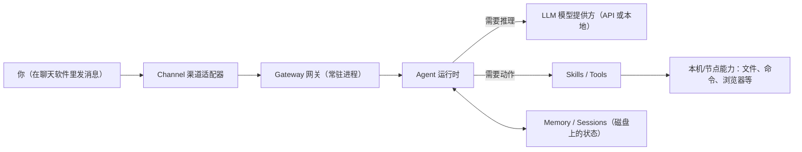

### 核心概念

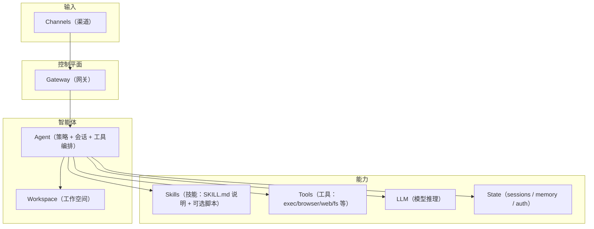

| 概念                      | 类比           | 作用                                       |
| :------------------------ | :------------- | :----------------------------------------- |
| **Gateway（网关）**       | 大楼的前台接待 | 接收所有外部消息，分发到正确的工作空间     |
| **Workspace（工作空间）** | 你的私人办公室 | 处理具体任务，管理对话历史和技能           |
| **LLM（大语言模型）**     | AI顾问大脑     | 理解你的意图，生成回复                     |
| **Skills（技能）**        | 工具箱里的工具 | 执行特定功能（查天气、写代码、管理日程等） |
| **Channels（渠道）**      | 通信设备       | 连接不同的消息平台                         |

### OpenClaw 到底是什么？

OpenClaw 是一个**完全开源、自己运行在你电脑上的 AI 助手**（以前叫 Clawdbot，后来改名）。
它不像 ChatGPT 那样只聊天，而是真正动手做事：

- 你在 WhatsApp 里说："帮我查一下明天航班"，它就能自动打开浏览器、登录航空公司网站、截图给你。
- 它支持几百个技能（Skills），社区还在不断增加。
- 它有长期记忆（记得你喜欢什么），还能自己生成新技能。
- 最重要的是：**你的会话、工作区文件、技能与日志主要保存在本机状态目录中**；但当你使用云端模型时，消息内容会按配置发送给对应模型提供方（你也可以选择本地模型来减少外发）。

核心思想：**把 AI 大模型（大脑） + 本地工具（手脚） + 聊天软件（嘴巴耳朵）连接起来**，让 AI 真正成为你的电脑管家。

### 整体架构：Gateway 是大脑指挥中心

OpenClaw 最核心的部分叫 **Gateway（网关）**。它就像你家里的总控台，所有东西都围绕它转。

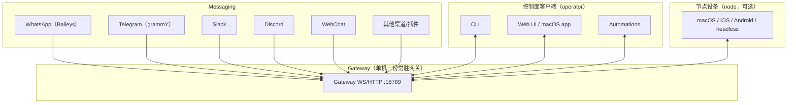

**各部分简单解释：**

- **Channel Bridge（通道桥接器）**：负责跟 WhatsApp、Telegram 等聊天软件"握手"。比如用 Baileys 库连接 WhatsApp。
- **Gateway**：核心常驻进程（默认绑定 `127.0.0.1:18789`），既承载各类渠道连接，也提供 WebSocket 控制面（CLI/Web UI/自动化/节点设备接入）。官方架构说明：一个 host 通常只运行一个 Gateway，WhatsApp 会话由 Gateway 独占管理。[参考](https://docs.openclaw.ai/concepts/architecture)
- **AI 大脑**：真正思考的是外部大模型（你提供 API Key），Gateway 只负责"叫它来干活"。
- **工具 & 技能**：AI 的手脚，比如打开浏览器、读写文件、发邮件。
- **记忆系统**：像笔记本，AI 不会忘掉你上次说的话。

------

## 一条消息是怎么变成行动的？

我们用一个真实例子："在 WhatsApp 里说：帮我把今天的邮件整理成总结发给我"。

流程图如下：

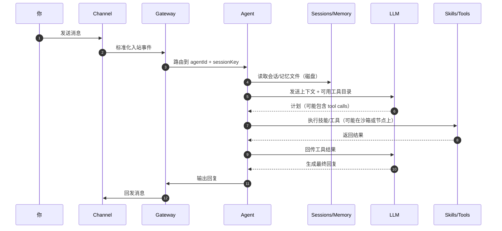

**详细拆解：**

1. **接收指令**：你发消息 → 聊天软件的 Bridge 把消息推给 Gateway。
2. **查找记忆**：Gateway 打开你的"个人档案"（Session + Memory），知道你是老用户、上次喜欢什么语气。
3. **AI 思考**：把消息 + 记忆打包发给 AI 大脑。AI 像聪明秘书："嗯，需要先读邮件，再总结。"
4. **调用工具**：AI 说"我要用 Gmail 技能"。Gateway/Agent 触发工具执行；这一步是否在沙箱中取决于你是否启用了沙箱与权限策略（可选）。[参考](https://docs.openclaw.ai/gateway/security)
5. **执行 + 反馈**：工具把结果给 AI，AI 写出总结。
6. **回复用户**：Gateway 把总结发回 WhatsApp。你就收到了！

------

## 整体架构

### 三层架构设计

OpenClaw 采用经典的三层架构，让我们从外到内逐层理解：

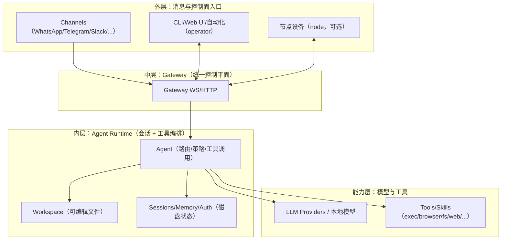

### 为什么要这样设计？

**类比**：想象一个大型公司

- **外层（用户接口）** = 客户可以通过电话、邮件、微信等多种方式联系公司
- **中层（Gateway）** = 前台接待，统一接待所有客户，然后分配到合适的部门
- **内层（Workspace）** = 不同的业务部门，各自负责不同的事务
- **底层（能力层）** = 公司的资源（专家顾问、工具设备等）

------

## 核心组件详解

### Gateway：统一的门户

**Gateway 是什么？**

Gateway（网关）是 OpenClaw 的大门，所有外部消息都必须先经过这里。

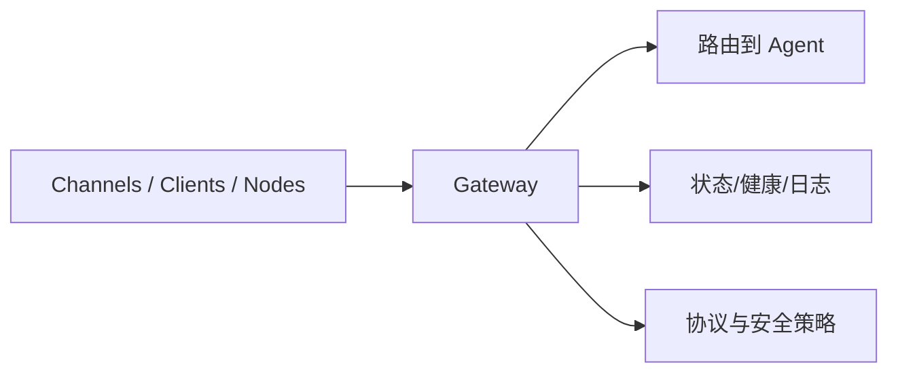

**Gateway 的三大职责：**

#### 1. 认证（Authentication）

确保只有你授权的平台才能连接

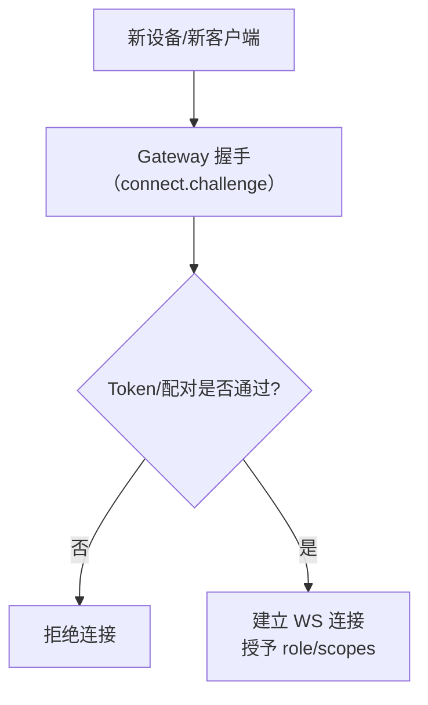

#### 2. 路由（Routing）

把消息送到正确的工作空间

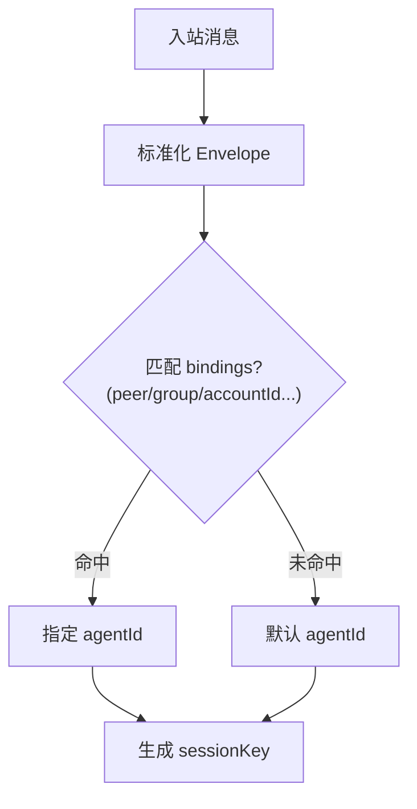

#### 3. 日志记录（Logging）

记录所有交互，方便调试和审计

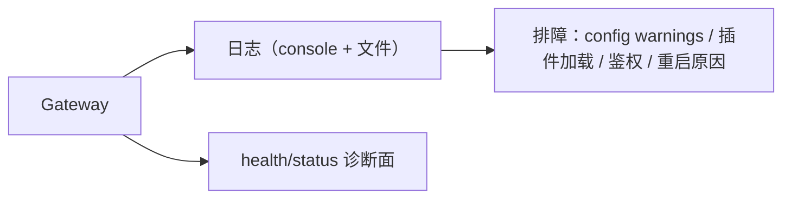

**启动 Gateway 的命令：**

```
# 启动网关，监听 18789 端口
openclaw gateway --port 18789 --verbose
```

### Workspace：你的私人办公室

**Workspace 是什么？**

Workspace（工作空间）是实际处理任务的地方。你可以有多个工作空间，每个负责不同的事情。

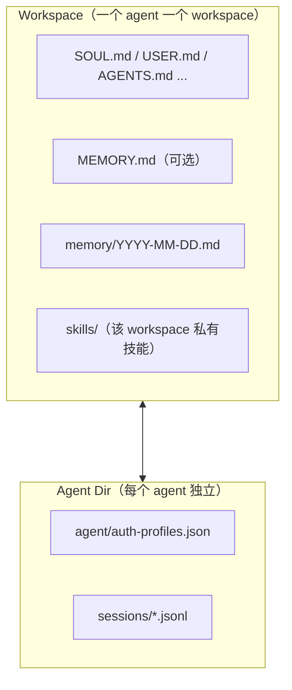

**一个典型的 Workspace 配置示例：**

```
~/.openclaw/openclaw.json（概念示例，字段以实际版本为准）
{
  "agents": {
    "list": [
      { "id": "main", "workspace": "~/.openclaw/workspace" }
    ]
  },
  "skills": {
    "entries": {
      "weather": { "enabled": true },
      "calendar": { "enabled": true }
    }
  },
  "channels": {
    "telegram": { "enabled": true }
  }
}
```

**多工作空间使用场景：**

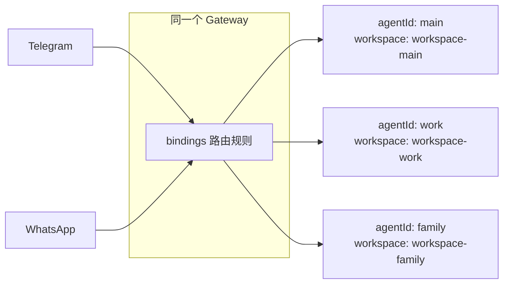

### LLM：AI 的大脑

**LLM 是什么？**

LLM（Large Language Model，大语言模型）是 OpenClaw 的智能大脑，负责理解你的意图和生成回复。

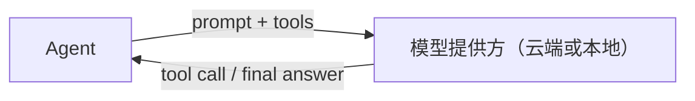

**OpenClaw 支持的 LLM（示例，以你实际配置与版本为准）：**

模型接入与鉴权通常由 `~/.openclaw/openclaw.json` 的 `models` 配置决定。[参考](https://docs.openclaw.ai/gateway/configuration)

| 提供商    | 模型示例        | 特点                 | 适用场景       |
| :-------- | :-------------- | :------------------- | :------------- |
| Anthropic | Claude Sonnet 4 | 平衡、安全、多语言好 | 日常对话、写作 |
| OpenAI    | GPT-4           | 专业、知识广         | 专业任务、分析 |
| DeepSeek  | DeepSeek-V3     | 代码能力强、便宜     | 编程辅助       |
| 本地部署  | Ollama          | 完全私有、免费       | 隐私敏感场景   |

### Channels：连接外部世界

**Channels 是什么？**

Channels（渠道）是连接各种消息平台的"适配器"。

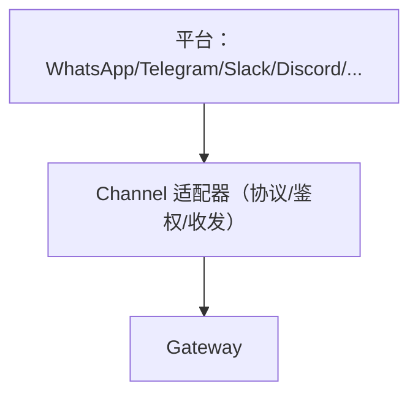

官方渠道清单与哪些是插件提供的渠道，见：[Chat Channels](https://docs.openclaw.ai/channels)

**每个 Channel 的工作：**

1. **接收消息**：从平台获取用户消息
2. **格式转换**：统一转换为 OpenClaw 内部格式
3. **发送回复**：把 OpenClaw 的回复发回平台

**示例：Telegram Channel 的工作流程**

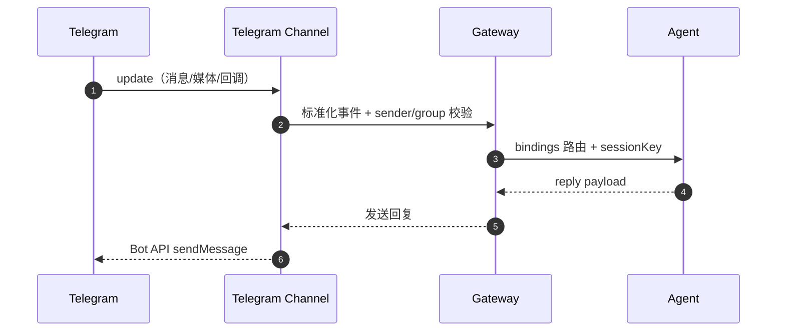

------

## 消息流转过程

现在让我们看看一条完整的消息是如何在 OpenClaw 中流转的：

### 完整消息流程图

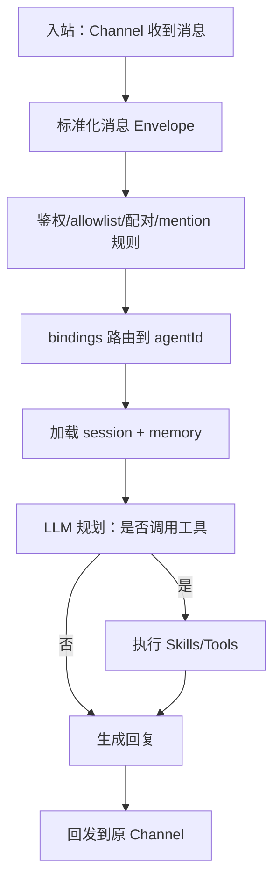

### 详细步骤解析

**步骤 1-3：消息接收与标准化**

用户在 Telegram 发送消息后，Telegram Channel 会将其转换为 OpenClaw 的标准格式：

```
{
  "platform": "telegram",
  "channel_id": "telegram_123",
  "user": {
    "id": "user_456",
    "name": "Alice"
  },
  "message": {
    "type": "text",
    "content": "上海明天天气?",
    "timestamp": "2024-03-09T10:30:00Z"
  }
}
```

**步骤 4-5：认证与路由**

Gateway 检查这个消息：

- 来源是否已授权？
- 应该路由到哪个 Workspace？
- 用户是否有权限？

**步骤 6-8：AI 理解与决策**

Workspace 准备完整的上下文发送给 LLM：

```
[系统提示]
你是一个个人助理，可以使用以下技能：
- weather: 查询天气
- calendar: 管理日程
- ...

[对话历史]
用户: 你好
助理: 你好！有什么可以帮你的？

[当前消息]
用户: 上海明天天气?
```

**步骤 9-12：技能执行**

LLM 决定调用 weather skill，Workspace 执行并获取结果：

```
{
  "location": "上海",
  "date": "2024-03-10",
  "weather": "晴转多云",
  "temperature": "18-26°C",
  "humidity": "60%",
  "wind": "东风 3-4级"
}
```

**步骤 13-17：生成回复并返回**

LLM 根据天气数据生成自然语言回复，通过原路返回给用户。

------

## 技能系统

### 什么是技能（Skills）？

技能是 OpenClaw 执行特定任务的"能力模块"。如果把 OpenClaw 比作一个人，技能就是这个人学会的各种本领。

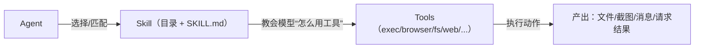

技能的目录与优先级规则（workspace > ~/.openclaw/skills > bundled）见：[Skills](https://docs.openclaw.ai/tools/skills)

### 技能的结构

每个技能包含：

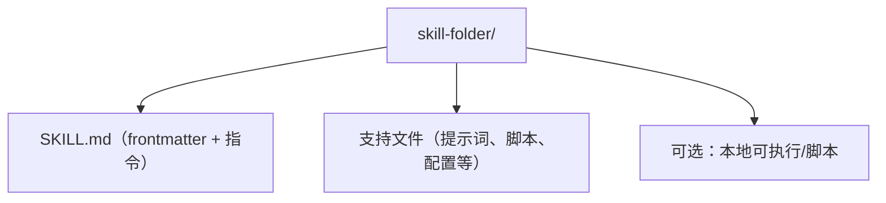

**示例：天气技能的定义**

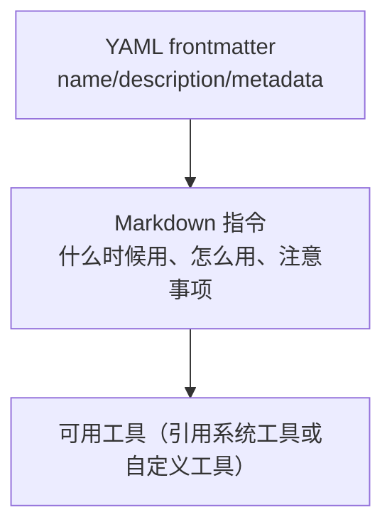

### 技能的调用流程

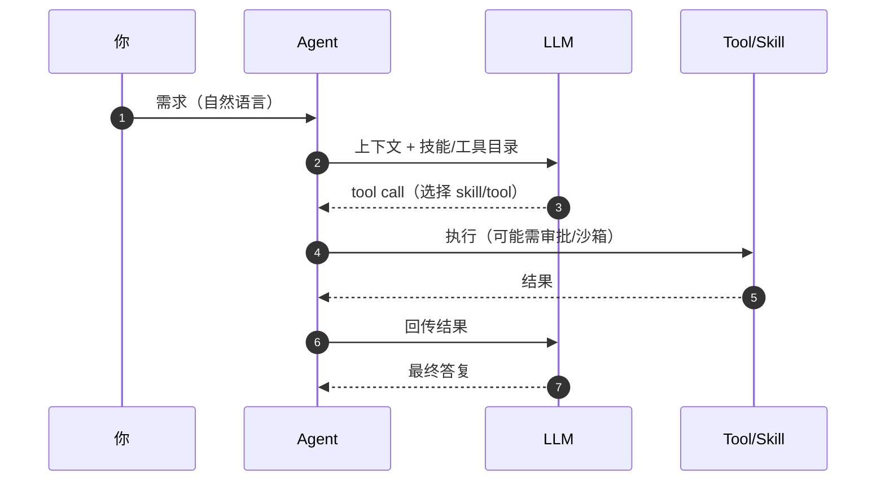

### 技能的安全机制

OpenClaw 对技能有严格的安全控制：

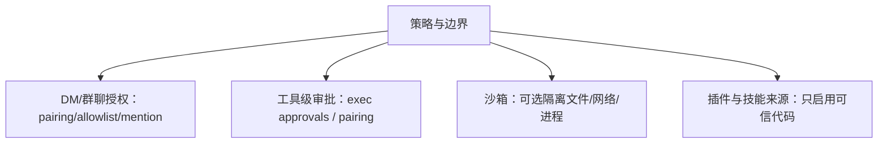

安全模型与注意事项见：[Security](https://docs.openclaw.ai/gateway/security)

**权限类型：**

| 权限         | 说明     | 示例             |
| :----------- | :------- | :--------------- |
| `network`    | 网络访问 | 查天气、搜索网页 |
| `filesystem` | 文件系统 | 读写文件         |
| `email`      | 邮箱访问 | 发送/接收邮件    |
| `calendar`   | 日历访问 | 管理日程         |
| `system`     | 系统操作 | 执行命令         |

------

## 完整工作流程

让我们通过一个真实场景，串联所有概念：

### 场景：定时发送每日天气报告

**需求**：每天早上 8 点，通过 Telegram 收到今日天气 + 日程提醒

```mermaid
flowchart LR
  CRON[cron/定时触发] --> AG[Agent 执行一次任务]
  AG --> W[weather skill/tool]
  AG --> CAL[calendar skill/tool]
  W --> AG
  CAL --> AG
  AG --> SEND[通过 Telegram Channel 发送消息]
```

### 配置代码

```
概念示例（用自然语言 + 技能组合描述计划）
目标：每天 08:00 触发一次
步骤：
1) 查询今天的天气（weather）
2) 列出今天的日程（calendar）
3) 组织成简短报告
4) 通过 Telegram 发送给我
```

### 用户收到的消息

```
早安！今日简报

天气情况
上海今天多云，气温 15-23°C
建议穿着：薄外套
降雨概率：10%

今日日程
- 09:00 - 10:00  团队晨会
- 14:00 - 15:30  客户演示
- 16:00 - 17:00  代码评审

温馨提示
今天有 3 个会议，建议提前准备演示材料。
```

------

## 数据流与状态管理

### 数据如何存储？

```mermaid
flowchart TB
  subgraph StateDir["状态目录（默认 ~/.openclaw，可由 OPENCLAW_STATE_DIR 改）"]
    CONF[openclaw.json]
    LOG[logs/]
    AGD["agents/&lt;agentId&gt;/<br/>- agent/auth-profiles.json<br/>- sessions/*.jsonl"]
  end
  subgraph Workspace["Workspace（每个 agent 一个）"]
    WFILES[SOUL.md/USER.md/AGENTS.md/...]
    WMEM[MEMORY.md（可选）]
    WDAY[memory/YYYY-MM-DD.md]
    WSK[skills/]
  end
  StateDir --- Workspace
```

记忆的“源数据是 Markdown 文件”与 daily log / MEMORY.md 的规则，见：[Memory](https://docs.openclaw.ai/concepts/memory)

**数据类型及存储方式：**

| 数据类型     | 存储方式     | 保留时间         | 示例                 |
| :----------- | :----------- | :--------------- | :------------------- |
| 当前会话状态 | 内存         | 直到会话结束     | 正在进行的对话上下文 |
| 对话历史     | 本地数据库   | 可配置（如30天） | 过去的聊天记录       |
| 用户配置     | 配置文件     | 永久             | API密钥、偏好设置    |
| 技能数据     | 技能自己管理 | 取决于技能       | 日程、邮件草稿       |
| 系统日志     | 日志文件     | 可配置           | 错误、调试信息       |

------

## 扩展性与插件生态

### 如何添加新功能？

OpenClaw 的设计允许轻松扩展：

```mermaid
flowchart LR
  NEED[新需求] --> CHOOSE{扩展方式}
  CHOOSE -->|装技能| SK[Skills（SKILL.md）]
  CHOOSE -->|装插件| PL[Plugins（新增 tools/channels/skills）]
  SK --> USE[Agent 在对话中调用]
  PL --> USE
```

### 技能安装流程

```mermaid
flowchart TB
  FIND[在 ClawHub 搜索/浏览技能] --> INSTALL["clawhub install &lt;slug&gt;"]
  INSTALL --> DIR["写入 &lt;workspace&gt;/skills/&lt;name&gt;/"]
  DIR --> PICKUP[新会话/下一次 agent turn 自动发现]
  PICKUP --> USE[在任务中使用该技能]
```

ClawHub 工作方式与默认安装目录策略见：[ClawHub](https://docs.openclaw.ai/tools/clawhub)

 
