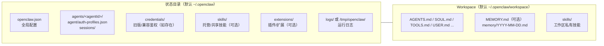
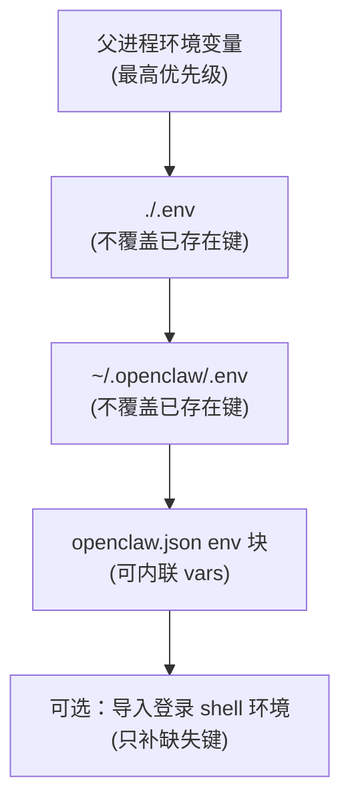

# OpenClaw 配置目录

OpenClaw（也称 Clawdbot）的状态目录默认在用户主目录下的 `~/.openclaw/`（Linux/macOS）或 `%USERPROFILE%\.openclaw\`（Windows）。其中包含配置、会话与鉴权等“运行态”数据；而你日常编辑的 **Workspace（工作区）** 也默认在 `~/.openclaw/workspace`，但可通过配置或环境变量指向其他位置。[参考](https://docs.openclaw.ai/concepts/agent-workspace)

**~/.openclaw/** 是整个系统的根配置目录，首次安装/运行 **openclaw onboard** 或 **openclaw onboard --install-daemon** 时会自动创建。

本文档以本机实际目录为准（macOS，OpenClaw 2026.3.13），结合官方文档对常见目录与排障点做了更贴近实情的说明。

```
~/.openclaw/
├── openclaw.json                  # 主配置文件（JSON/JSON5）
├── extensions/                    # 本地安装的扩展/插件（通常由 openclaw 自动管理）
│   ├── feishu/
│   └── openclaw-lark/
├── logs/                          # 可选：部分运行方式会写入这里（更常见是 /tmp/openclaw/）[参考](https://docs.openclaw.ai/help/faq)
├── agents/                        # Agent 运行态与会话状态
│   └── main/
│       ├── agent/
│       │   ├── auth-profiles.json
│       │   └── models.json
│       └── sessions/              # 会话记录（不建议纳入 workspace 的 git 备份）[参考](https://docs.openclaw.ai/concepts/agent-workspace)
├── credentials/                   # 旧版/兼容：部分安装会把鉴权放在这里（如存在）[参考](https://docs.openclaw.ai/concepts/agent-workspace)
├── sandboxes/                     # 启用 sandbox 时的隔离工作区（如启用）[参考](https://docs.openclaw.ai/concepts/agent-workspace)
├── skills/                        # 托管技能目录（如使用托管/共享技能）[参考](https://docs.openclaw.ai/tools/skills)
├── workspace/                     # 默认工作区（建议 git 版本控制）[参考](https://docs.openclaw.ai/concepts/agent-workspace)
│   ├── SOUL.md
│   ├── USER.md
│   ├── IDENTITY.md
│   ├── AGENTS.md
│   ├── BOOTSTRAP.md
│   ├── HEARTBEAT.md
│   ├── TOOLS.md
│   ├── memory/                    # 工作区内每日记忆日志（推荐）[参考](https://docs.openclaw.ai/concepts/memory)
│   └── skills/                    # 已安装的 Skills（每个技能一个子文件夹）
├── devices/                       # 设备配对/待配对信息
├── identity/                      # 设备身份与认证状态
└── exec-approvals.json            # 命令执行授权记录
```



**最重要文件**：

- `openclaw.json`：全局设置（模型、渠道、端口、安全策略）
- `workspace/` 下的 `.md` 文件：日常可直接用 VS Code 编辑（多数在下次加载/重启相关组件后生效）
- 日志：优先用 `openclaw logs --follow` 聚合查看（出现 “Config warnings” / 插件加载 / 鉴权 / 重启原因 时优先看）。[参考](https://docs.openclaw.ai/help/faq)

查看/修改配置命令：

```
openclaw configure                         # 交互式配置向导
openclaw config file                       # 显示配置文件完整路径
openclaw config get agents.defaults.workspace
openclaw config get gateway.port
openclaw config set agents.defaults.heartbeat.every "2h"
openclaw config validate                   # 校验合法性
```

| 路径                                    | 用途说明                                                                                                                                                                                                                                                                                         |
| :-------------------------------------- | :----------------------------------------------------------------------------------------------------------------------------------------------------------------------------------------------------------------------------------------------------------------------------------------------- |
| `~/.openclaw/openclaw.json`             | **主配置文件**（最重要！） 存储全局设置（模型、Gateway 模式、绑定地址、Agents 默认值、插件等）。 可用命令查看/修改： • `openclaw config file`（显示完整路径） • `openclaw config get <json路径>` • `openclaw config set <json路径> <值>`                                                         |
| `~/.openclaw/workspace/`                | **默认工作区**（建议 git 版本控制） 常见文件： • `SOUL.md`（人格/语气） • `USER.md`（个人偏好） • `AGENTS.md`（多 Agent 路由） • `TOOLS.md`（工具偏好/规则） • `IDENTITY.md`（身份）等；记忆在 `MEMORY.md` 与 `memory/YYYY-MM-DD.md`。 [参考](https://docs.openclaw.ai/concepts/agent-workspace) |
| `~/.openclaw/agents/<agentId>/`         | Agent 运行态目录。常见：`main/`。其中 `agent/auth-profiles.json` 存储该 Agent 的鉴权配置（请勿泄露）。`sessions/` 存储会话状态。                                                                                                                                                                 |
| `~/.openclaw/skills/`                   | 托管/共享技能目录（如使用）。工作区 `skills/` 的优先级更高。 [参考](https://docs.openclaw.ai/tools/skills)                                                                                                                                                                                       |
| `~/.openclaw/extensions/`               | 本地安装的扩展/插件源码与构建产物（排障时可定位到具体文件路径）。                                                                                                                                                                                                                                |
| `~/.openclaw/logs/` 或 `/tmp/openclaw/` | 网关与运行日志（不同运行方式位置可能不同）。推荐用 `openclaw logs --follow`。 [参考](https://docs.openclaw.ai/help/faq)                                                                                                                                                                          |

## 备份与迁移（实用）

- 把 Workspace 当作“记忆仓库”：建议私有 git 备份 `~/.openclaw/workspace/`（包含 `AGENTS.md`、`SOUL.md`、`memory/` 等），但它不包含会话历史和鉴权信息。[参考](https://docs.openclaw.ai/concepts/agent-workspace)
- 想“原样迁移到新机器”：复制状态目录（默认 `~/.openclaw/`）+ Workspace（默认 `~/.openclaw/workspace/`），再跑一次 `openclaw doctor`。[参考](https://docs.openclaw.ai/help/faq)

## 环境变量与自定义路径

OpenClaw 支持用环境变量改变配置/状态目录位置，适合做“服务账号隔离”、多实例或把状态迁移到别的磁盘：

- `OPENCLAW_HOME`：覆盖内部路径解析的 home（影响 `~/.openclaw` 等默认位置）
- `OPENCLAW_STATE_DIR`：覆盖状态目录（默认 `~/.openclaw`）
- `OPENCLAW_CONFIG_PATH`：覆盖主配置文件路径（默认 `~/.openclaw/openclaw.json`）
- `OPENCLAW_PROFILE`：配置 profile（非 `default` 时默认工作区会变成 `~/.openclaw/workspace-<profile>`）[参考](https://docs.openclaw.ai/concepts/agent-workspace)

环境变量读取来源（不会覆盖已存在的进程环境变量）通常包括：当前目录 `.env`、`~/.openclaw/.env`，以及配置文件中的 `env` 块；也可以启用“登录 shell 导入”来补齐缺失变量（只补缺失键）。[参考](https://docs.openclaw.ai/gateway/configuration)



## 1. 主配置文件

**路径:** `~/.openclaw/openclaw.json`

**说明:** OpenClaw 的核心配置文件,包含所有系统级设置。

**主要配置项:**

- **gateway** - 网关服务配置
  - `mode`: 网关模式(如 "local")
  - `port`: 网关端口号(默认 18789)
  - `bind`: 绑定地址（不同版本可能是 "loopback"/"0.0.0.0" 等）
  - `auth.token`: 访问令牌,用于 Web UI 认证
- **models** - AI 模型配置
  - 默认模型设置
  - API 认证信息
- **messages** - 消息处理配置
  - TTS(文本转语音)设置
  - 消息格式配置

**示例配置片段:**

```
{
  "gateway": {
    "mode": "local",
    "port": 18789,
    "bind": "loopback",
    "auth": {
      "mode": "token",
      "token": "<your-token>"
    }
  }
}
```

**操作建议:**

- 首次安装后通过 `openclaw onboard` 向导自动生成
- 配置支持热加载：多数字段可无停机生效；`gateway.*`、`plugins` 等基础设施类字段需要重启（默认 hybrid 模式会自动重启关键变更）。[来源](https://docs.openclaw.ai/gateway/configuration)
- token 值用于 Web UI 访问,请妥善保管

## 2. 工作区目录

**路径:** `~/.openclaw/workspace/`

**说明:** Workspace 是 Agent 的默认工作目录（默认 cwd），也是你日常编辑的“操作指令 + 记忆”所在位置。它不是硬沙箱：相对路径会落在工作区内，但未启用 sandbox 时，工具仍可能通过绝对路径访问宿主机其他位置。[参考](https://docs.openclaw.ai/concepts/agent-workspace)

**主要用途:**

- AI 智能体读写文件的默认位置
- 代码执行输出存储
- 文档生成和编辑
- 临时数据存储

**权限说明:**

- 默认 cwd 在工作区内，但是否允许访问工作区外，取决于你启用的沙箱/工具策略
- 如需强隔离，使用 `agents.defaults.sandbox`（启用后会在 `~/.openclaw/sandboxes/` 下创建隔离工作区）[参考](https://docs.openclaw.ai/concepts/agent-workspace)

**使用建议:**

- 定期清理不需要的临时文件
- 重要输出建议备份到工作区外
- 可以在此建立项目子目录进行组织管理

## 3. 智能体状态目录

**路径:** `~/.openclaw/agents/<agentId>/`

**说明:** Agent 的运行态目录。常见 `main/`。其中会话状态通常存放在 `sessions/` 下。

**目录结构:**

```
~/.openclaw/agents/<agentId>/
├── agent/
│   ├── auth-profiles.json    # 该 Agent 的 OAuth 和 API 密钥
│   └── ...
└── ...
```

**auth-profiles.json 说明:**

- 存储该智能体使用的 API 认证信息
- 包含各个服务的 OAuth token
- 新版本使用此路径为主；旧版可能使用 `~/.openclaw/credentials/`（如存在）

**数据隔离:**

- 每个 Agent 的认证信息相互独立
- 可以为不同 Agent 配置不同的 API 密钥
- 支持多智能体并行运行

## 4. 认证凭据目录(旧版)

**路径:** `~/.openclaw/credentials/`

**说明:** 旧版本 OpenClaw 的凭据存储位置。

**迁移说明:**

- 新版本已迁移至 `~/.openclaw/agents/<agentId>/agent/auth-profiles.json`
- 旧版本用户升级后,凭据可能需要重新配置
- 建议使用 `openclaw models auth setup` 重新设置

## 5. 记忆存储目录

**路径（源数据）:** `~/.openclaw/workspace/`

**说明:** OpenClaw 的记忆源数据是 Workspace 里的纯 Markdown 文件：`MEMORY.md`（长期记忆，可选）与 `memory/YYYY-MM-DD.md`（每日记忆日志）。索引/检索能力由启用的 memory 插件提供；插件可能在状态目录下生成缓存/索引文件，但“写在 Workspace 的 Markdown 才是事实来源”。[参考](https://docs.openclaw.ai/concepts/memory)

**主要文件:**

- **`MEMORY.md`**（可选）- 精炼的长期记忆（偏好、长期事实、决策）
- **`memory/YYYY-MM-DD.md`** - 每日记忆日志（建议读今天 + 昨天作为会话起点）

**记忆功能:**

- **检索:** 使用 `openclaw memory search "关键词"` 从历史记忆中取回相关片段
- **分层:** `MEMORY.md` 适合“长期稳定事实”，`memory/YYYY-MM-DD.md` 适合“当日上下文/流水账”[参考](https://docs.openclaw.ai/concepts/memory)
- **现实限制:** 模型上下文窗口有限；长对话会压缩/截断，因此需要“写入磁盘的记忆”来跨会话延续[参考](https://docs.openclaw.ai/help/faq)

**维护建议:**

- 定期备份/提交 Workspace（尤其是 `MEMORY.md` 与 `memory/`）
- daily 文件会长期累积；需要更可控的长期记忆时，把关键结论提炼进 `MEMORY.md`[参考](https://docs.openclaw.ai/concepts/memory)

## 6. 技能目录（Skills）

**常见路径（以本机为例）:**

- `~/.openclaw/workspace/skills/`：工作区内的技能（更常见）
- `~/.openclaw/extensions/<pluginId>/skills/`：随插件/扩展一起提供的技能包
- `~/.openclaw/skills/`：部分版本/安装方式可能使用的全局技能目录（如存在）

**说明:** Skills 用于扩展 OpenClaw 功能，既可能来自插件，也可能来自 ClawHub 安装到工作区。

**技能管理:**

- **安装 ClawHub CLI:** `npm i -g clawhub`（或 `pnpm add -g clawhub`）[参考](https://docs.openclaw.ai/tools/clawhub)
- **搜索技能:** `clawhub search "calendar"`
- **安装技能:** `clawhub install <skill-slug>`
- **更新技能:** `clawhub update --all`

**常用技能示例:**

- `filesystem-mcp` - 文件系统操作
- `github` - GitHub 集成
- `nano-pdf` - PDF 编辑
- `notion` / `obsidian` - 笔记同步
- `weather` - 天气查询
- `summarize` - 内容摘要生成

**技能生态:**

- 支持自定义技能开发
- 技能可访问外部 API 和系统资源

**配置说明:**

- 每个技能可能需要单独的 API Key 配置
- 部分技能依赖系统工具(如 GitHub CLI)
- macOS 专有技能在 Windows/Linux 上不可用

## 7. 网关日志目录

**路径:** `~/.openclaw/logs/` 或 `/tmp/openclaw/`

**说明:** 网关服务的运行日志。排查配置告警（Config warnings）、插件加载、鉴权、重启原因等优先看这里。推荐优先用 `openclaw logs --follow` 聚合查看；当 RPC 不可用时，再直接查看文件日志。不同安装/运行方式下文件日志可能位于 `~/.openclaw/logs/` 或 `/tmp/openclaw/`。[参考](https://docs.openclaw.ai/help/faq)

**日志类型:**

- 网关启动/停止日志
- API 请求/响应日志
- 错误和异常日志
- 性能监控信息

**日志管理:**

- 使用 `openclaw gateway --verbose` 可以查看详细日志
- 排查问题时应首先检查日志文件

**网关服务管理:**

```
openclaw gateway start    # 启动网关
openclaw gateway status   # 查看状态
openclaw gateway stop     # 停止网关
openclaw gateway restart  # 重启网关（配置变更后常用）
```

------

## 其他重要文件

### USER.md

**路径:** 通常位于 `~/.openclaw/workspace/USER.md`

**说明:** 用户信息文件,包含关于用户的个性化信息,帮助 AI 更好地理解用户需求。

**内容示例:**

- 用户偏好设置
- 常用工作流程
- 项目背景信息
- 自定义指令

## 常见排障：插件重复加载（duplicate plugin id）

当日志出现类似告警：

- `plugin feishu: duplicate plugin id detected; later plugin may be overridden`

通常意味着同一个插件 id（例如 `feishu`）被从多个路径同时发现/加载。插件发现有固定优先级：配置路径（`plugins.load.paths`）→ workspace 扩展 → `~/.openclaw/extensions` → 内置扩展。重复 id 的情况下，高优先级的那份会成为“激活插件”，低优先级的会被忽略（并可能伴随告警提示）。[来源](https://docs.openclaw.ai/tools/plugin)

- `plugins.load.paths` 手动加了全局安装目录（如 npm 全局安装的 `openclaw/extensions/...`）
- 同时又在 `~/.openclaw/extensions/` 中安装了同名插件

处理建议（优先级从高到低）：

1. 优先保留 `~/.openclaw/extensions/<id>/` 的安装，移除 `plugins.load.paths` 中指向全局扩展目录的路径
2. 如果某个旧插件条目不再使用，可将 `plugins.entries.<id>.enabled` 设为 `false`
3. 设置 `plugins.allow` 为你信任的插件 id，避免自动加载未追踪的本地代码
